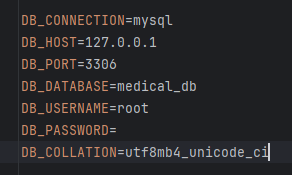

## Learning Laravel

Laravel has the most extensive and thorough [documentation](https://laravel.com/docs) and video tutorial library of all modern web application frameworks, making it a breeze to get started with the framework.

You may also try the [Laravel Bootcamp](https://bootcamp.laravel.com), where you will be guided through building a modern Laravel application from scratch.

If you don't feel like reading, [Laracasts](https://laracasts.com) can help. Laracasts contains thousands of video tutorials on a range of topics including Laravel, modern PHP, unit testing, and JavaScript. Boost your skills by digging into our comprehensive video library.

## Tutorial git clone Laravel project

Долженбыть установлен Node.js

1. Clone your project ``git clone ССЫЛКА_НА_ПРОЕКТ``
2. Go to the folder application using ``cd`` command on your cmd or terminal
3. Run ``composer install`` on your cmd or terminal
4. Copy ``.env.example`` file to ``.env`` on the root folder. You can type ``copy .env.example .env`` if using command prompt Windows or ``cp .env.example .env`` if using terminal, Ubuntu
5. Open your ``.env`` file and change the database name (``DB_DATABASE``) to whatever you have, username (``DB_USERNAME``) and password (``DB_PASSWORD``) field correspond to your configuration. Add field ``DB_COLLATION`` which value ``utf8mb4_unicode_ci``

   Example:

   
6. Create database which name ``DB_DATABASE``
7. Run ``php artisan key:generate``
8. Run ``php artisan migrate``
9. Run ``npm install``
10. Run ``npm run build``
11. Run ``php artisan serve``
12. Go to http://localhost:8000/

## Полезные ссылки

#### [Сайт Медозон ](https://ulmedozon.ru/)

### Видосики по работе с view
- [View часть 1](https://www.youtube.com/watch?v=ySSLtZJtvzI&list=PLd2_Os8Cj3t8pnG4ubQemoqnTwf0VFEtU&index=15)
- [View часть 2](https://www.youtube.com/watch?v=Hrldxy5_x4Y&list=PLd2_Os8Cj3t8pnG4ubQemoqnTwf0VFEtU&index=16)

## Маршруты (routes)

- Главная **[ GET localhost/client/ ]**
- О клинике **[ GET localhost/client/contacts ]**
- Услуги (список категорий) **[ GET localhost/client/categories ]**
- Услуги (список услуг по категории) **[ GET localhost/client/services/{category_id} ]**
- Специалисты **[GET localhost/client/specialists ]**
